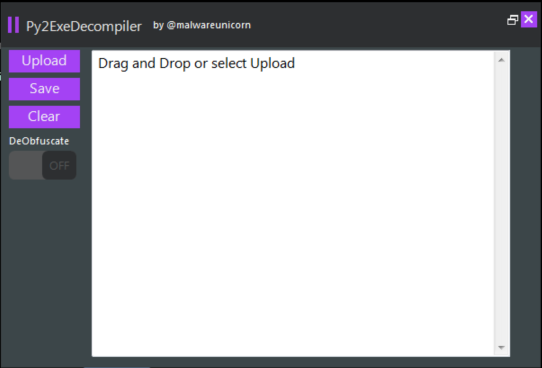
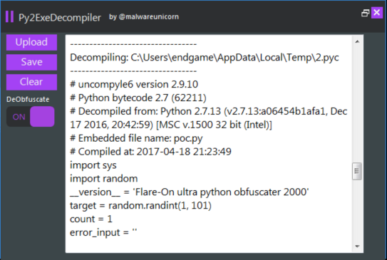

# Py2ExeDecompiler

Decompiles Exe created by Py2Exe using uncompyle6 for both python 2 and 3.

Contact: Amanda Rousseau (@malwareunicorn)

Download the release here: [Py2ExeDecompiler.exe](Py2ExeDecompiler/bin/Release/Py2ExeDecompiler.exe)

## Requirements:

* Python 2.7, required for 2.7 py2exe binaries
* Python 3-3.5 required for python 3 binaries
* (optional) Python 3.6, will only show disassembly
* .NET Framework 4.5.2+

## Usage:

Drag and Drop or Upload an Exe compiled with Py2Exe

## Features

* Able to decompile Python 2.7-3.5 binaries
* Uses Uncompyle6 to decompile extracted .pyc from exe's resources.
* Will be able to deobfuscate flare-on challenge kahki.exe
* [Reference](https://www.fireeye.com/content/dam/fireeye-www/global/en/blog/threat-research/flareon2016/challenge6-solution.pdf)

### References

* UI library: https://github.com/saneki/FlatUI
* Uncompyle6 binary converted to exe using Py2Exe
  * https://github.com/rocky/python-uncompyle6
  * http://www.py2exe.org/
* Deobfuscation: https://github.com/fireeye/flare-bytecode_graph
